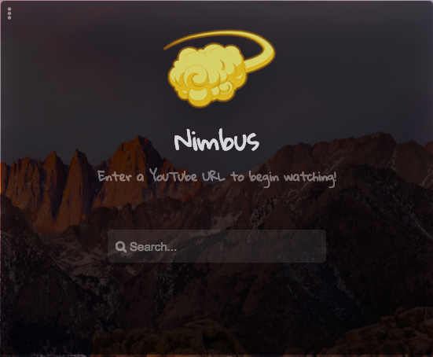
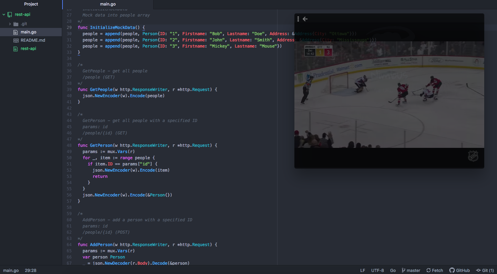

<p align="center">
  
  <h1 align="center">Nimbus</h1>
</p>

> Cross platform, multi-tasking video player

## Features
- Transparent application
- Place it anywhere
- Easy multi-tasking
- Cross platform on MacOS, Windows & Linux




## Installation
> Install npm packages
```
npm install
```

### Clone
- Clone this repo to your local machine using `https://github.com/gurveerdhindsa/nimbus.git`

### Development
```
npm run build
```
```
npm run dev
```
> To start webpack-dev-server. Electron will launch automatically

##  Support
- Website at <a href="https://gurveerdhindsa.github.io/portfolio/" target="_blank">`gurveerdhindsa.github.io`</a>